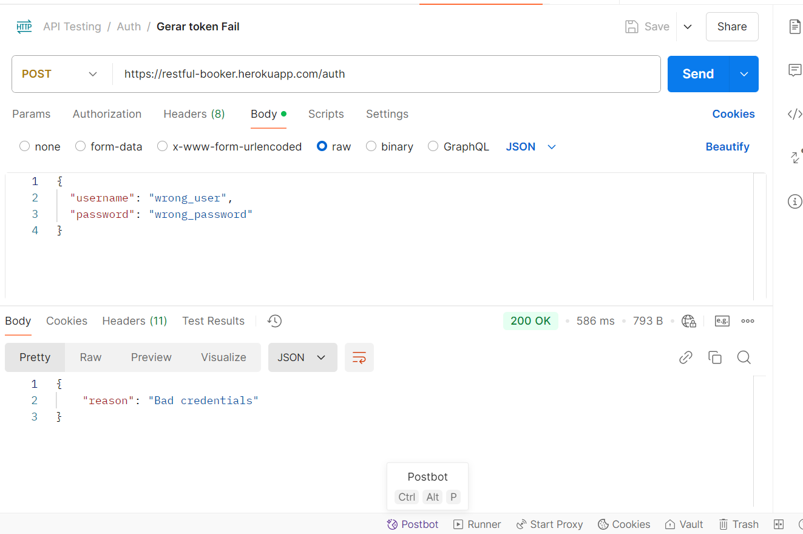

Para o teste de API foi utilizado o POSTMAN, onde foi criado a coleção abaixo:
[Collection](<API Testing.postman_collection.json>)

Endpoints Testados: 
/auth, /booking

Cenários:
**Autenticação**
1. Gerar token de autenticação
Requisição:
POST /auth

{
  "username": "admin",
  "password": "password123"
}

Resultado esperado:
Retorna um token válido.
Código de status: 200 OK.

Resultado obtido:

2. Tentar gerar token com credenciais inválidas
Requisição:
POST /auth

{
  "username": "wrong_user",
  "password": "wrong_password"
}

Resultado esperado:
Resposta esperada: 403 Forbidden.
Mensagem de erro clara.

Resultado obtido:

**Gestão de Reservas**
1. Criar uma nova reserva
Requisição:
POST /booking

{
  "firstname": "Thaneya",
  "lastname": "Pereira",
  "totalprice": 150,
  "depositpaid": true,
  "bookingdates": {
    "checkin": "2024-12-01",
    "checkout": "2024-12-10"
  },
  "additionalneeds": "cafe da manha e estacionamento"
}

Resultado esperado:
Código de status: 200 OK.
Retorno da nova reserva com um bookingid.

Resultado obtido:

2. Buscar uma reserva específica
Requisição:
GET /booking/{bookingid}

Resultado esperado:
Código de status: 200 OK.
Dados retornados correspondem ao bookingid.

Resultado obtido:

3. Listar todas as reservas
Requisição:
GET /booking

Resultado esprado:
Código de status: 200 OK.
Retorno de uma lista com bookingid.

Resultado obtido:

4. Atualizar uma reserva existente
Requisição:
PUT /booking/{bookingid}

{
  "firstname": "Jane",
  "lastname": "Smith",
  "totalprice": 200,
  "depositpaid": false,
  "bookingdates": {
    "checkin": "2024-12-05",
    "checkout": "2024-12-15"
  },
  "additionalneeds": "Dinner"
}

Resultado esperado:
Código de status: 200 OK.
Dados atualizados corretamente.

Resultado obtido:

5. Deletar uma reserva
Requisição:
DELETE /booking/{bookingid}

Authorization: Bearer {token}

Resultado esperado:
Código de status: 201 Created.
Confirme que a reserva foi removida.

Resultado obtido:

**Filtros e Buscas**
1. Buscar reservas por nome
Requisição:
GET /booking?firstname=Thaneya

Resultado esperado:
Código de status: 200 OK.
Confirme que todas as reservas retornadas pertencem a "Thaneya".

Resultado obtido:

2. Buscar reservas por data de check-in
Requisição:
GET /booking?checkin=2024-12-01

Resultado esperado:
Código de status: 200 OK.
Confirme que as reservas retornadas têm checkin igual a 2024-12-01.

Resultado obtido:

3. Buscar reservas por data de check-out
Requisição:
GET /booking?checkout=2024-12-10

Resultado esperado:
Código de status: 200 OK.
Confirme que as reservas retornadas têm checkout igual a 2024-12-10.

Resultado obtido:

Observações: 
Metodos de PUT não pegaram o token, dando como retorno FORBIDDEN.
Na busca de reserva por nome (GET) retorno 200 OK esperado, porem não trouxe dados da reserva que foi buscada.