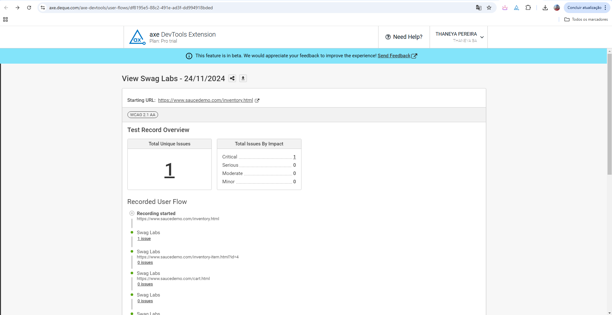
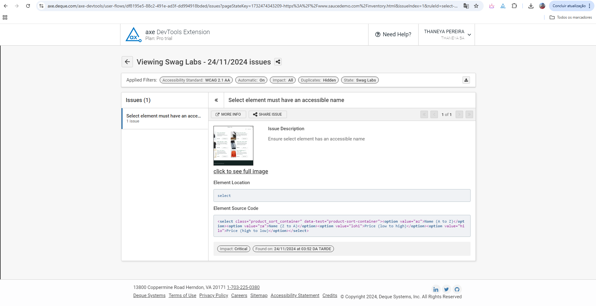

Plano de testes de acessibilidade para a plataforma Sauce Demo, baseado em diretrizes como as WCAG (Web Content Accessibility Guidelines) e nas melhores práticas para garantir a inclusão digital.

1. Objetivo
Garantir que a plataforma Sauce Demo seja acessível a todos os usuários, incluindo pessoas com deficiência. O objetivo é verificar se a aplicação cumpre os requisitos mínimos de acessibilidade e oferece uma experiência inclusiva para os usuários.

2. Escopo
-Testar os fluxos de login, navegação de produtos, carrinho de compras, checkout, e logout com foco na acessibilidade.
-Validar que a plataforma seja utilizável com tecnologias assistivas (como leitores de tela) e em diferentes dispositivos (como teclados, navegação por voz, etc.).

3. Requisitos
-Ferramentas de acessibilidade para testes: 
  -Leitores de tela(ex: JAWS, NVDA, VoiceOver).
  -Ferramentas de auditoria de acessibilidade(ex: Axe, Lighthouse).
  -Teclado (para navegação sem mouse).
  -Ferramentas de alto contraste.
  
-Navegadores compatíveis: Google Chrome
-Sistema Operacional: Windows

4. Casos de Teste de Acessibilidade

CTA01. Teste de Navegação por Teclado
Objetivo: Verificar se todos os elementos interativos da página são acessíveis usando apenas o teclado.

Passos:
  1.Acessar a plataforma Sauce Demo.
  2.Navegar por todos os elementos interativos usando as teclas Tab (para avançar) e Shift + Tab (para voltar).
  3.Verificar se todos os botões, links e campos de formulário são acessíveis e focáveis.
  4.Testar a interação com campos de entrada (login, checkout, etc.) e botões (como “Adicionar ao Carrinho” e “Checkout”).
  5.Usar a tecla Enter para ativar os elementos interativos.

Resultado Esperado: Todos os elementos interativos são acessíveis via teclado e o foco segue uma ordem lógica e sequencial.

Resultado Obtido:
<video controls src="20241124-1835-27.1246403.mp4" title="LoginFailTab"></video> aberto BUG04
<video controls src="20241124-1840-06.4764660.mp4" title="ondeclica"></video> aberto BUG05

CTA02. Teste de Leitores de Tela
Objetivo: Verificar se o conteúdo da página é lido corretamente por leitores de tela (como JAWS, NVDA ou VoiceOver).

Passos:
  1.Usar um leitor de tela (ex: NVDA no Windows ou VoiceOver no macOS).
  2.Acessar a página inicial da plataforma Sauce Demo.
  3.Navegar por todos os elementos da página (produtos, botões de login, links, campos de formulário, etc.).
  4.Verificar se o leitor de tela lê corretamente as informações (como nomes de produtos, preços, textos de botões).

Resultado Esperado: O leitor de tela deve ler todas as informações de forma clara e precisa, incluindo rótulos de botões e campos de formulário.

Resultado Obtido:
<video controls src="20241124-1844-13.9553836.mp4" title="LeitorPessimo"></video> aberto BUG06

CTA03. Teste de Contraste de Cores
Objetivo: Verificar se há contraste suficiente entre o texto e o fundo para garantir legibilidade para usuários com deficiência visual (como daltonismo).

Passos:
  1.Usar uma ferramenta de auditoria de contraste de cores (como Color Contrast Analyzer ou o Axe).
  2.Testar os elementos de texto da plataforma (como cabeçalhos, textos de botões, preços e descrições de produtos) em relação ao fundo da página.
  3.Verificar se o contraste de cores entre o texto e o fundo atende ao mínimo exigido pelas WCAG (um contraste de pelo menos 4.5:1 para texto normal e 3:1 para texto grande).

Resultado Esperado: Todos os textos devem ter contraste suficiente em relação ao fundo, de modo que sejam legíveis por usuários com deficiência visual.

Resultado Obtido:

<!-- CTA04. Teste de Uso de ARIA (Accessible Rich Internet Applications)**
Objetivo: Verificar se a aplicação utiliza corretamente as propriedades ARIA para melhorar a acessibilidade de elementos dinâmicos, como menus, formulários e carrosséis de produtos.

Passos:
  1.Usar uma ferramenta como o Axe ou Lighthouse para auditar a página.
  2.Verificar se os elementos interativos (como botões de "Adicionar ao Carrinho", menus de navegação e campos de entrada de dados) possuem as propriedades ARIA apropriadas.
  3.Testar os comportamentos dinâmicos (como adicionar/remover produtos do carrinho ou avançar para o checkout) para garantir que sejam anunciados corretamente pelo leitor de tela.

Resultado Esperado: Os elementos interativos devem ser descritos adequadamente para tecnologias assistivas, e a navegação dinâmica deve ser anunciada.

Resultado Obtido:

CTA05. Teste de Foco Visível
Objetivo: Verificar se o foco dos elementos interativos (botões, campos de formulário, links) é visível ao navegar com o teclado.

Passos:
  1.Usar apenas o teclado para navegar pela página (com as teclas Tab e Shift + Tab).
  2.Verificar se o foco é visível para os elementos interativos (botões, campos de texto, links).
  3.Verificar se o foco tem contraste suficiente para ser facilmente identificado, com um estilo visual claro, como uma borda ou uma mudança de cor.

Resultado Esperado: O foco dos elementos interativos deve ser visível durante toda a navegação.

Resultado Obtido:

CTA06. Teste de Conteúdo em Texto Simples**
Objetivo: Garantir que o conteúdo da plataforma esteja disponível em formato acessível para tecnologias assistivas, como leitores de tela.

Passos:
  1.Acessar a página inicial e navegar pelos produtos e seções da plataforma.
  2.Verificar se o conteúdo está em formato de texto e não em imagens de texto (quando o texto puder ser lido, deve ser fornecido como texto, e não apenas como imagem).
  3.Verificar a legibilidade do conteúdo textual.

Resultado Esperado: Todo o conteúdo relevante deve ser fornecido como texto simples, sem depender exclusivamente de imagens ou elementos não legíveis por leitores de tela.

CTA07. Teste de Navegação por Voz (Voice Control)**
Objetivo: Verificar se a navegação da plataforma é possível por comandos de voz.

Passos:
  1.Ativar o comando de voz no dispositivo (ex: Assistente de Voz no Windows ou Voice Control no macOS).
  2.Tentar realizar ações comuns usando comandos de voz, como "Ir para o carrinho", "Adicionar ao carrinho", "Login" e "Finalizar compra".

Resultado Esperado: As principais funcionalidades devem ser acessíveis por comandos de voz, permitindo uma navegação completa e funcional.

CTA08. Teste de Alternativas Textuais para Imagens**
Objetivo: Verificar se todas as imagens possuem alternativas textuais (atributo alt) adequadas.

Passos:
  1.Usar uma ferramenta de auditoria de acessibilidade (como Axe ou Lighthouse) para verificar se todas as imagens possuem texto alternativo.
  2.Examinar se as imagens relevantes para a navegação e compra (como as fotos dos produtos) têm descrições precisas.

Resultado Esperado: Todas as imagens relevantes possuem descrições alternativas (alt text), permitindo que usuários com deficiência visual compreendam o conteúdo. -->

5. Critérios de Aceite
Todos os elementos interativos devem ser acessíveis via teclado.
O conteúdo deve ser corretamente lido por leitores de tela.
O contraste de cores deve ser suficiente para garantir legibilidade.
Todos os conteúdos de texto devem ser acessíveis sem depender de imagens ou elementos não legíveis.
O uso de ARIA deve ser adequado para garantir a acessibilidade de conteúdos dinâmicos.
A navegação por voz e outros dispositivos assistivos deve ser funcional.

