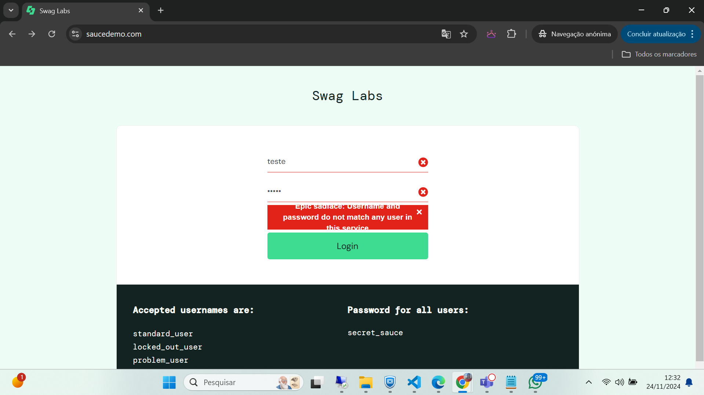
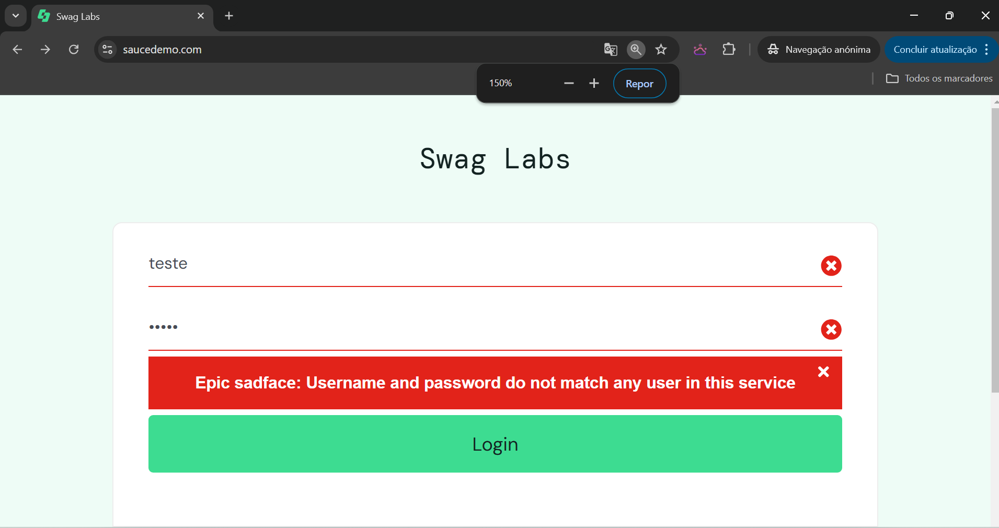
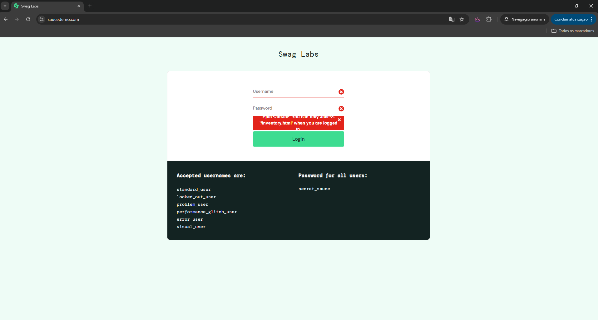

BUG01 - Mensagem de credencial inválida não dá pra ser lida com o zoom da página em 100% apenas acima de 150%

Descrição:
Verificar comportamento com credenciais inválidas.

Passos:
1.Acessar a URL do Sauce Demo.
2.Informar credenciais inválidas.
3.Clicar no botão "LOGIN".

BUG02 - Quando o sistema perde a sessão o sistema mostra uma mensagem muito ruim

BUG03 - Na tela da lista do produto o ícone de seta pra baixo do filtro não funciona, sendo possivel utilizar o filtro apela se clicarmos no item selecionado do combo.
