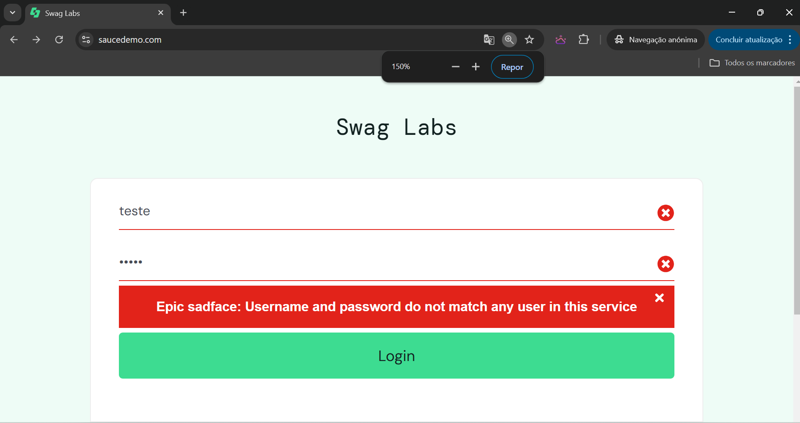
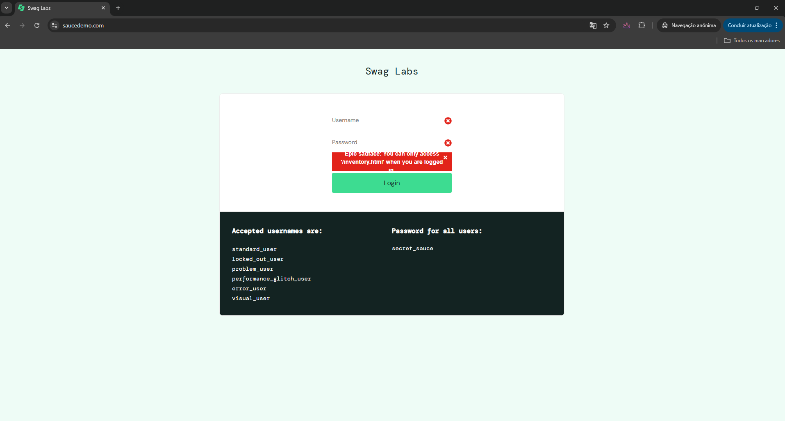

BUG01 - Mensagem de credencial inválida não dá pra ser lida com o zoom da página em 100% apenas acima de 150%

Descrição:
Verificar comportamento com credenciais inválidas.

Passos:
1.Acessar a URL do Sauce Demo.
2.Informar credenciais inválidas.
3.Clicar no botão "LOGIN".

BUG02 - Quando o sistema perde a sessão o sistema mostra uma mensagem muito ruim

BUG03 - Na tela da lista do produto o ícone de seta pra baixo do filtro não funciona, sendo possivel utilizar o filtro apela se clicarmos no item selecionado do combo.

BUG04 - [acessibilidade] Problema pra clicar no login com a tecla tab e enter
<video controls src="Evidencias/20241124-1835-27.1246403.mp4" title="LoginFailTab"></video> 

BUG05 - [acessibilidade] Problema em identificar onde ta o click via tab
<video controls src="Evidencias/20241124-1840-06.4764660.mp4" title="ondeclica"></video>

BUG06 - [acessibilidade] Leitor se perde, nao le tudo, coisas nao adaptadas para leitura
<video controls src="Evidencias/20241124-1844-13.9553836.mp4" title="LeitorPessimo"></video>

BUG07 - [resposividade] Imagens deformadas para smartphones
<video controls src="Evidencias/20241124-2035-50.4825810.mp4" title="Title"></video>
