Plano de testes para a plataforma de e-commerce Sauce Demo.

1. Objetivo
Garantir que todos os fluxos essenciais da aplicação Sauce Demo funcionem conforme o esperado, proporcionando uma experiência sem falhas para o usuário.

2. Escopo
Os testes irão cobrir os seguintes fluxos principais:

Acesso à plataforma e login.
Navegação por produtos.
Adição de produtos ao carrinho.
Remoção de itens do carrinho.
Processamento do pagamento (Checkout).
Logout.

3. Requisitos
Navegador compatível (Chrome, Firefox, Safari, etc.).
Acesso ao Sauce Demo: https://www.saucedemo.com/.
Acesso à internet.

4. Ambiente de Testes
Sistema Operacional: Windows 11
Navegador: Google Chrome
Resolução de Tela: 1920x1080.

5. Casos de Teste

CT01. Teste de Login - Credencial válida
Objetivo: Verificar se o login é realizado corretamente.

Passos:
1.Acessar a URL do Sauce Demo.
2.Informar as credenciais válidas:
Usuário: standard_user
Senha: secret_sauce
3.Clicar no botão "LOGIN".

Resultado Esperado: O usuário é redirecionado para a página inicial de produtos.

Resultado Obtido:
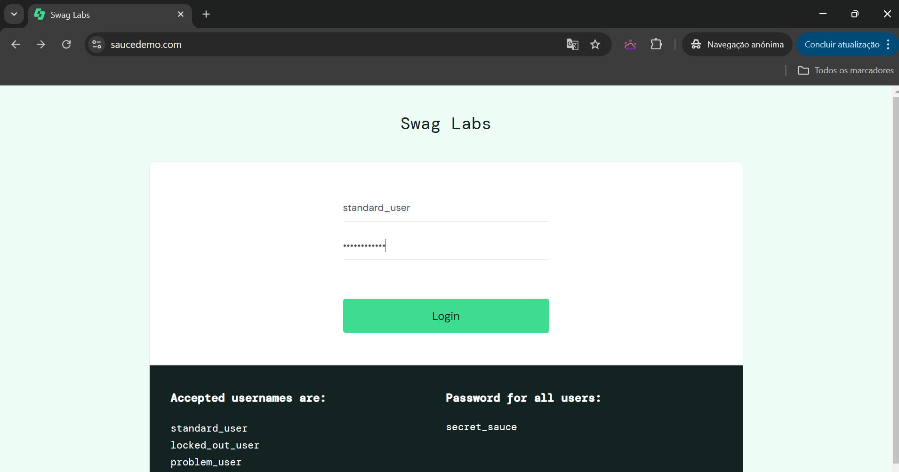
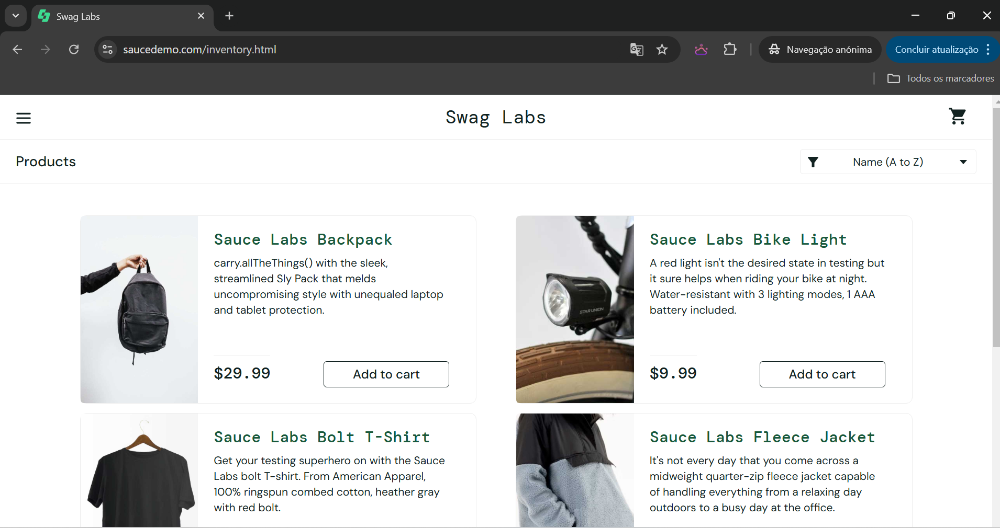

CT02. Teste de Login - Credencial Inválida
Objetivo: Verificar comportamento com credenciais inválidas.

Passos:
1.Acessar a URL do Sauce Demo.
2.Informar credenciais inválidas.
3.Clicar no botão "LOGIN".

Resultado Esperado: O sistema exibe uma mensagem de erro, como "Epic sadface: Username and password do not match any user in this service".

Resultado Obtido:
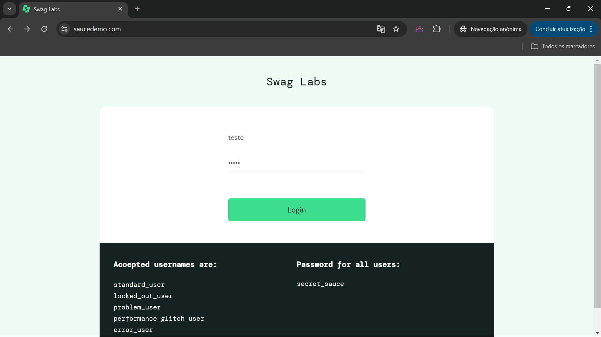
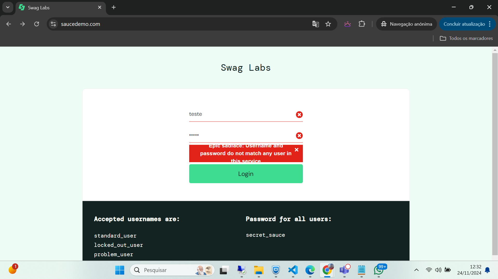 aberto BUG01

CT03. Teste de Navegação de Produtos
Objetivo: Verificar a navegação pelos produtos.

Passos:
1.Realizar login com usuário válido.
2.Acessar a lista de produtos.
3.Verificar se todos os produtos estão visíveis (nome, imagem e preço).
4.Navegar entre as páginas de produtos.

Resultado Esperado: A página de produtos carrega corretamente, exibindo os detalhes de cada item e permitindo navegação entre as páginas.

Resultado Obtido:

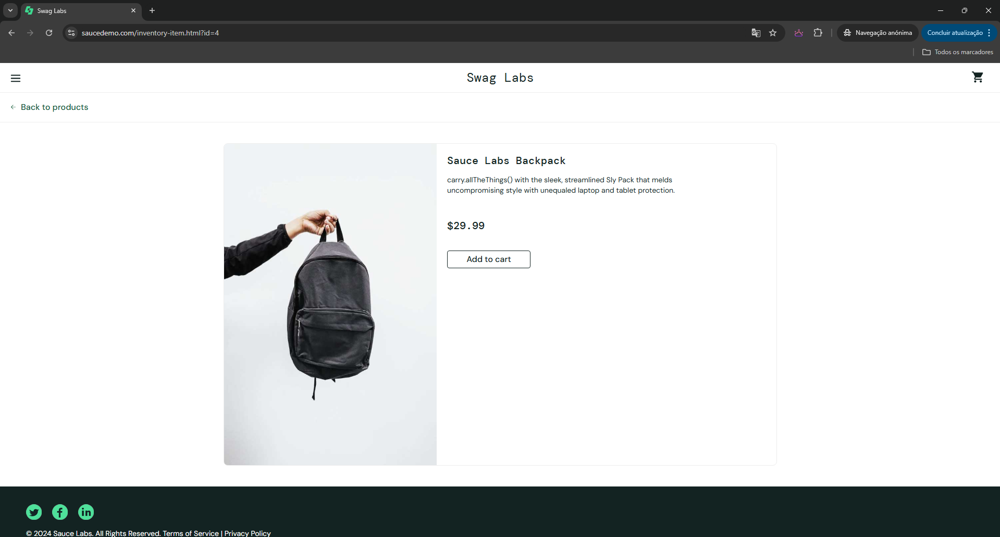

CT04. Teste de Adição de Produto ao Carrinho
Objetivo: Verificar se o processo de adicionar produtos ao carrinho funciona corretamente.

Passos:
1.Realizar login com usuário válido.
2.Escolher um produto na página de produtos.
3.Clicar no botão "Add to cart" (Adicionar ao carrinho).
4.Verificar se o ícone do carrinho é atualizado para refletir a quantidade de itens.

Resultado Esperado: O produto é adicionado ao carrinho e o ícone do carrinho mostra o número correto de itens.

Resultado Obtido:

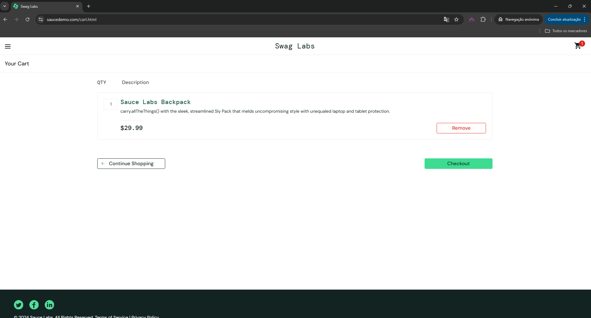
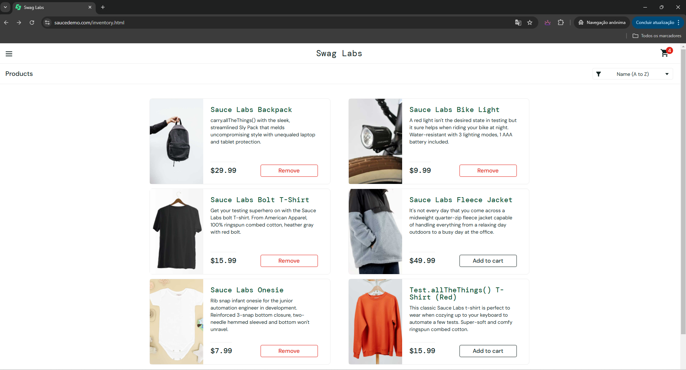
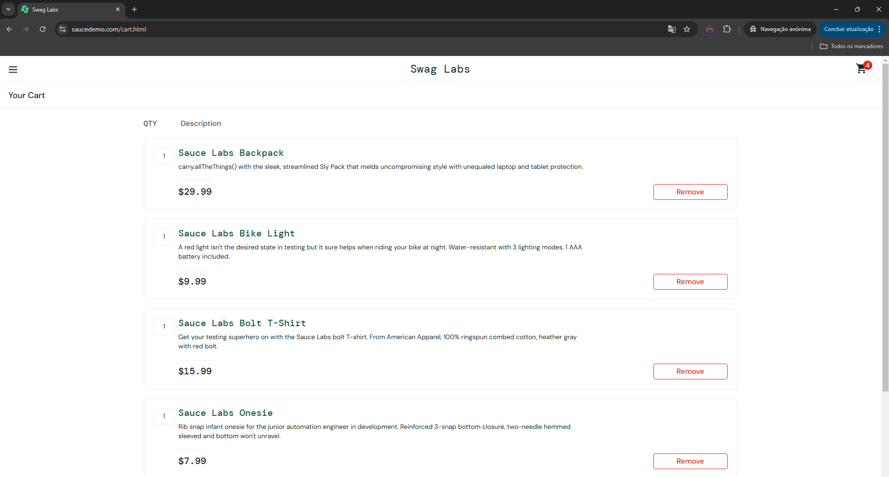

CT05. Teste de Remoção de Produto do Carrinho
Objetivo: Verificar se o produto pode ser removido do carrinho corretamente.

Passos:
1.Realizar login com usuário válido.
2.Adicionar um produto ao carrinho.
3.Acessar a página do carrinho.
4.Clicar no botão "Remove" (Remover) ao lado do produto.

Resultado Esperado: O produto é removido do carrinho e o ícone de carrinho é atualizado para refletir a quantidade correta de itens.

Resultado Obtido:

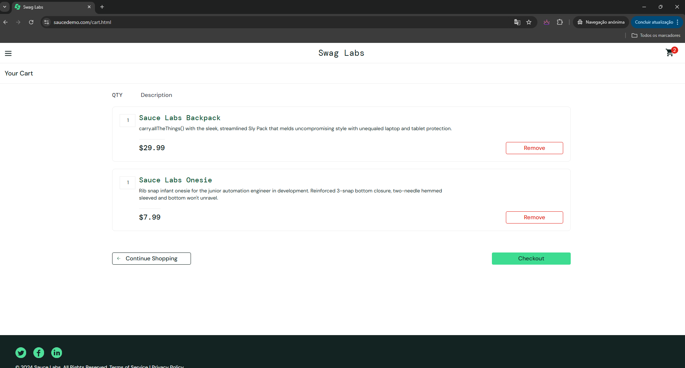

CT06. Teste de Processo de Checkout
Objetivo: Verificar se o checkout funciona corretamente, desde o carrinho até a confirmação do pedido.

Passos:
1.Realizar login com usuário válido.
2.Adicionar produtos ao carrinho.
3.Acessar o carrinho de compras.
4.Clicar no botão "Checkout".
5.Preencher as informações de "First Name", "Last Name" e "Zip Code" para o envio.
6.Clicar em "Continue".
7.Selecionar o método de pagamento e confirmar a compra.

Resultado Esperado: O sistema redireciona para a página de confirmação de pedido com o status "Your order has been processed".

Resultado Obtido:
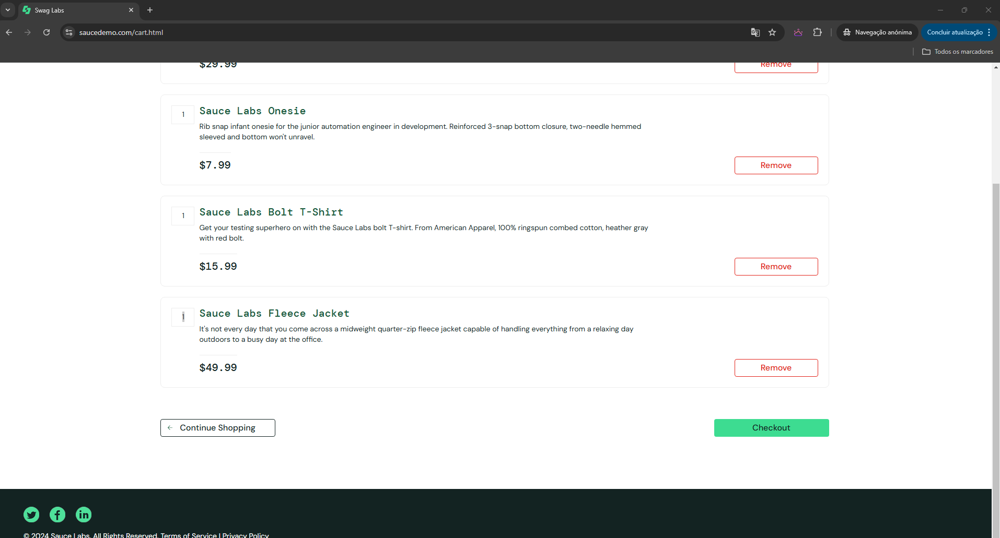
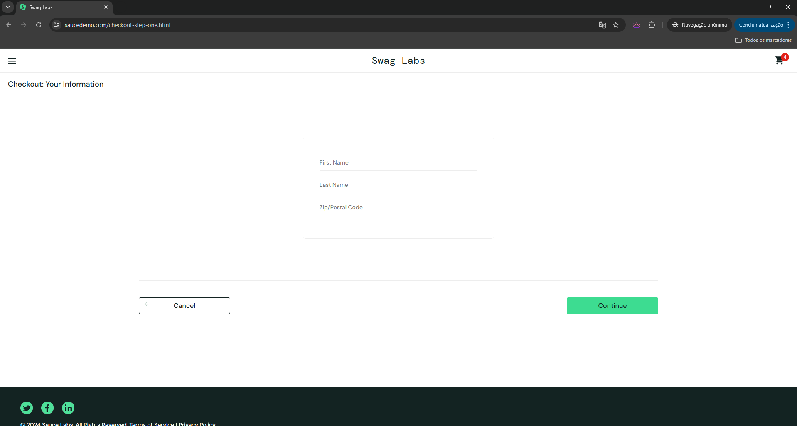
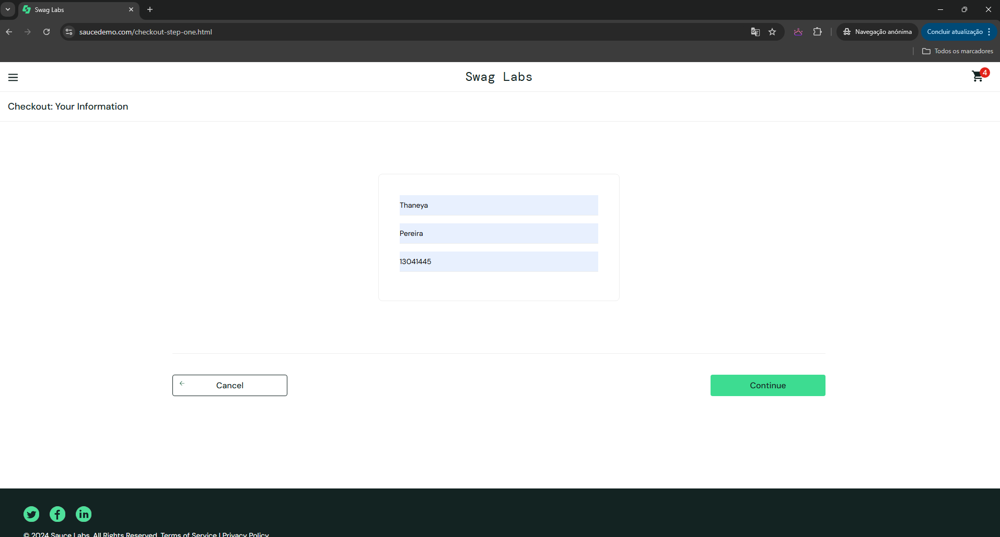
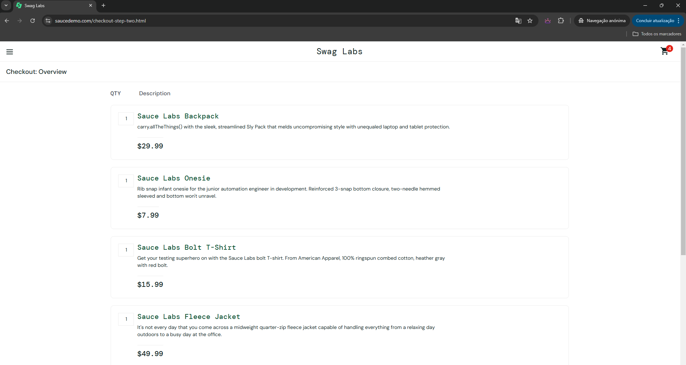
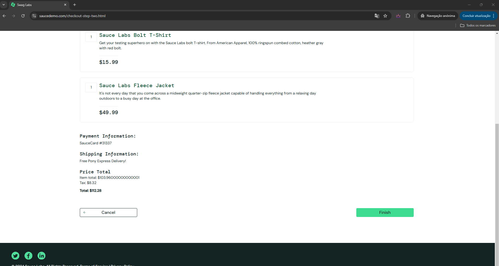
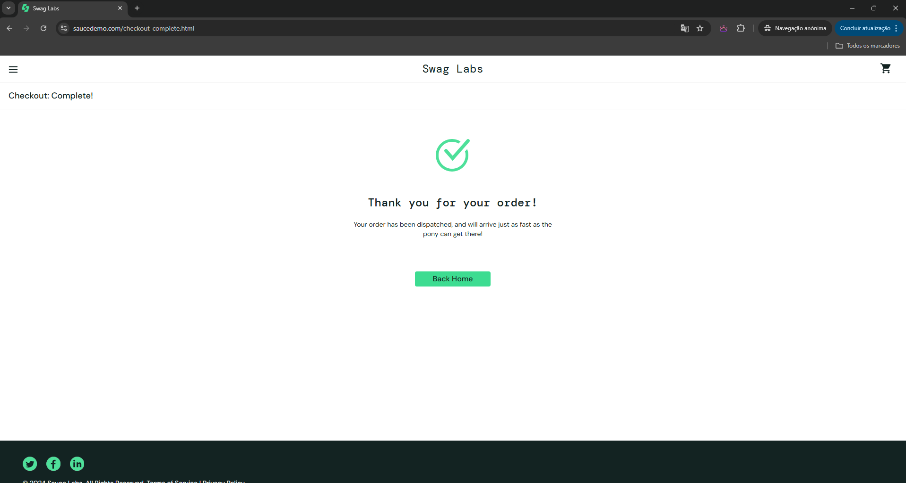

CT07. Teste de Logout
Objetivo: Verificar se o logout funciona corretamente.

Passos:
1.Realizar login com usuário válido.
2.Clicar no menu de usuário no canto superior direito.
3.Selecionar a opção "Logout".

Resultado Esperado: O usuário é redirecionado para a tela de login.

Resultado Obtido:

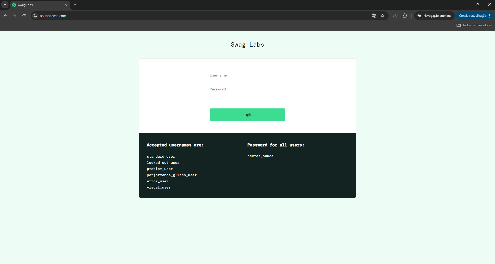

CT08. Teste de Navegação sem Login
Objetivo: Verificar o comportamento ao tentar navegar ou acessar funcionalidades sem estar logado.

Passos:
1.Acessar o Sauce Demo sem fazer login. (colando URL especifica)
2.Tentar acessar a página de produtos.

Resultado Esperado: O sistema deve redirecionar para a tela de login.

Resultado Obtido:
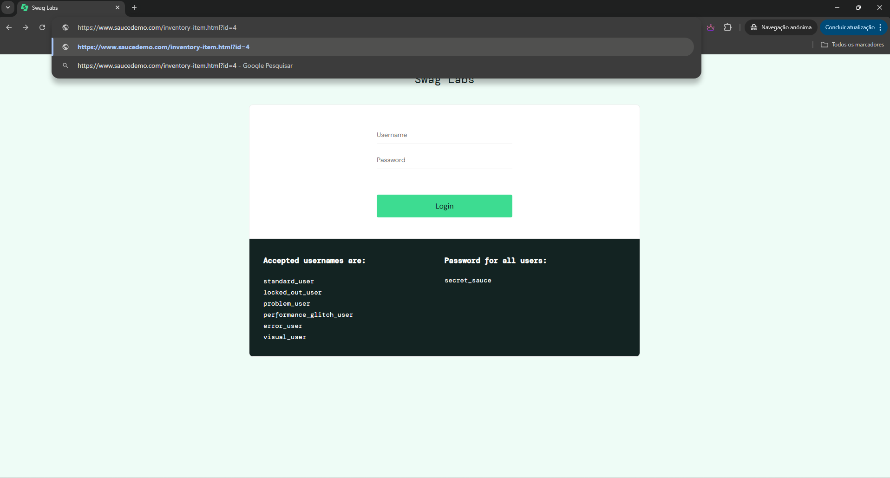
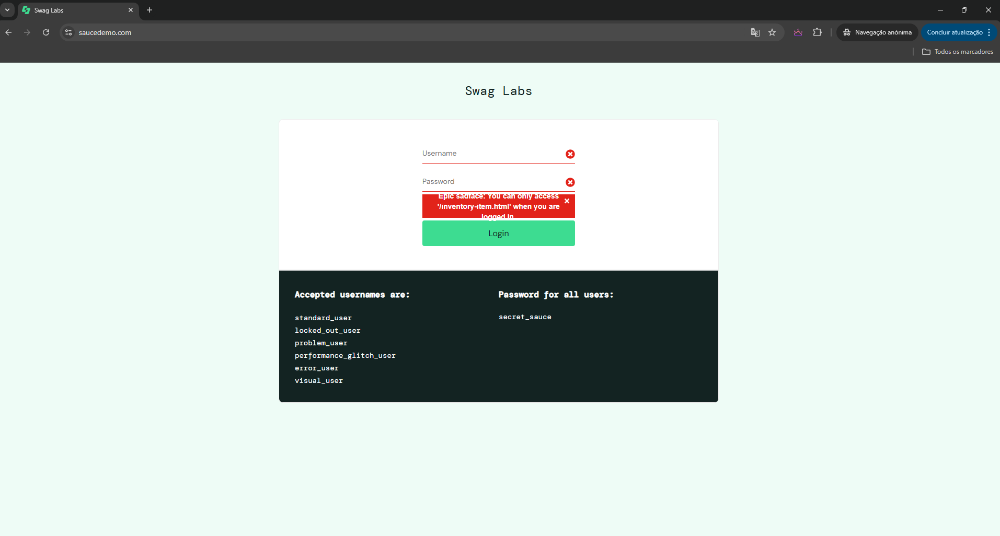

6. Critérios de Aceitação

Todos os fluxos principais, como login, navegação, adição ao carrinho, checkout e logout, devem funcionar corretamente.
Não devem ocorrer falhas ou erros visíveis durante os testes de navegação e interação com os elementos da interface.
O desempenho da plataforma deve ser satisfatório, com carregamento rápido das páginas.

8. Plano de Execução

   
Frequência dos Testes: Testes devem ser realizados após cada nova versão ou atualização da plataforma, ou sempre que houver modificações no código relevante para os fluxos de navegação e compra.
Responsáveis: Testadores e QA (Quality Assurance) da equipe de desenvolvimento.

